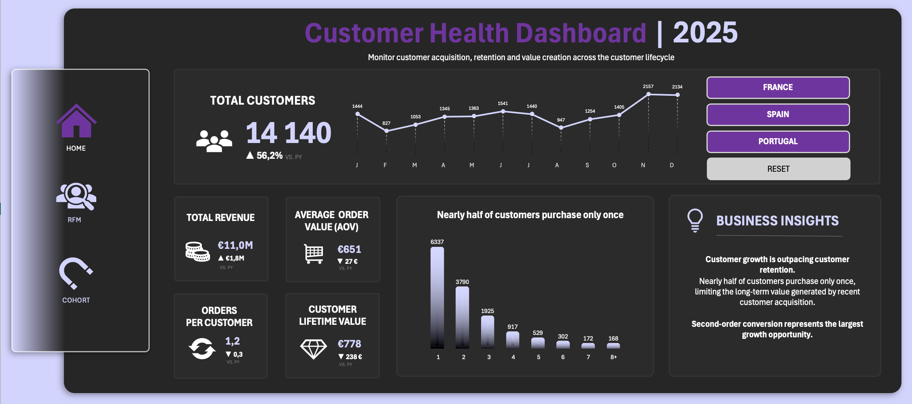
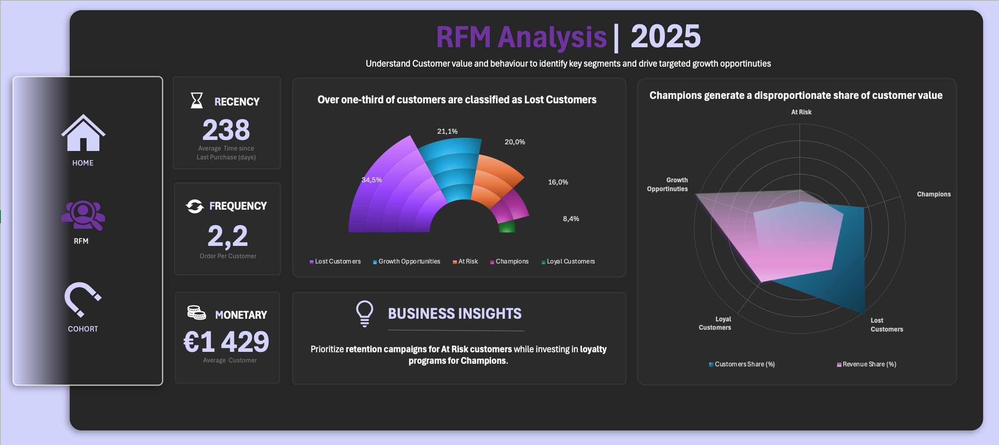
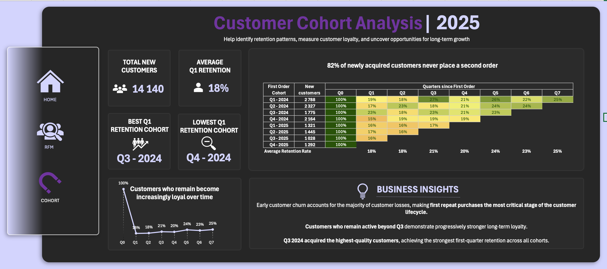

# 04 Customer Analytics
> <i>Customer Health, RFM Segmentation & Cohort Analysis</i>

This repository contains the **Customer Analytics** analytical module of the [**NAVA Business Intelligence Portfolio**](https://github.com/ammflo-ops/NAVA-Business-Intelligence-Portfolio/blob/main/README.md).

Built entirely in Microsoft Excel, it complements the NAVA Business Intelligence solution by analysing customer acquisition, customer value and long-term retention.

---

# 📖 Overview

## Business Objective

Evaluate customer health throughout the customer lifecycle by measuring acquisition, purchasing behaviour, customer value and retention to identify opportunities for sustainable business growth.

## 📊 Customer Health Dashboard
_Provides an executive overview of customer acquisition, purchasing behaviour and customer value._
<p align="center">
  
</p>

### Analytical Focus
- Customer Growth
- Customer Value
- Purchasing Behaviour

### Key Insights

- Customer acquisition grew significantly.
- Nearly half of customers purchase only once.
- Customer lifetime value declined despite revenue growth.

## 📊 RFM Dashboard

_Segments customers according to Recency, Frequency and Monetary value to identify high-value customers, customers at risk and growth opportunities._
<p align="center">
  
</p>

### Analytical Focus
- Customer Segmentation
- Customer Value Distribution
- Retention Priorities

### Key Insights

- Champions generate a disproportionate share of revenue.
- Lost Customers account for the largest customer segment.
- Growth Opportunities present the greatest upside.
  
## 📊 Cohort Analysis Dashboard

_Measures customer retention across acquisition cohorts to understand how customer loyalty evolves over time._
<p align="center">
  
</p>

### Analytical Focus
- Customer Retention
- Cohort Performance
- Customer Lifecycle

### Key Insights

- Early customer churn remains the main retention challenge.
- Only 18% of customers place a second order.
- Retained customers become increasingly loyal over time.
---
# 📖 Executive Summary

## Overall Findings

The analysis highlighted three key themes across the customer lifecycle:

- Strong customer acquisition continues to drive business growth.
- Customer value remains concentrated among a relatively small group of loyal customers.
- Most customer attrition occurs immediately after the first purchase, limiting long-term customer value.

## Recommendations & Next Steps

- **Improve early customer retention** to reduce first-time customer churn.
- **Increase Customer Lifetime Value** through repeat purchasing strategies.
- **Convert Growth Opportunities into Champions** through targeted engagement.
- Balance customer acquisition **with long-term customer value**.
  
---

# 📂 Repository Structure

```text
04_Customer_Analytics
│
├── dashboards/
│   ├── customer_Analytics_Dashboard.xlsx     # Executive dashboards
│   ├── customer_health_dashboard.png
│   ├── rfm_dashboard.png
│   └── cohort_dashboard.png
│
├── workpapers/
│   ├── customer_health_analysis.xlsx          # Customer Health workpaper
│   ├── rfm_analysis.xlsx                      # RFM analysis workpaper
│   └── cohort_analysis.xlsx                   # Cohort analysis workpaper
│
└── README.md
```
---
# 🔗 Quick Access

| Resource | Description | Link
|-----------|-------------|-------------|
| 📊 Interactive Dashboard | Executive customer analytics dashboards. | [View](dashboards/customer_analytics_dashboard.xlsx)
| 📄 customer Health Workpaper | KPI calculations and business metrics. | [View](workpapers/customer_health_analysis.xlsx)
| 📄 RFM Analysis Workpaper | RFM scoring methodology and customer segmentation. | [View](workpapers/rfm_analysis.xlsx)
| 📄 Cohort Analysis Workpaper | Cohort methodology and retention calculations. | [View](workpapers/cohort_analysis.xlsx)
---

# 💡 About this Project

This repository contains the **Customer Analytics** analytical module of the [**NAVA Business Intelligence Portfolio**](https://github.com/ammflo-ops/NAVA-Business-Intelligence-Portfolio/blob/main/README.md).

Unlike the Tableau dashboards included in the core Business Intelligence solution, this project demonstrates how advanced customer analytics can be performed entirely in Microsoft Excel.

The repository combines executive dashboards with fully documented analytical workpapers, illustrating the complete process from customer KPI calculation to RFM segmentation and cohort retention analysis using a structured, audit-inspired methodology.
